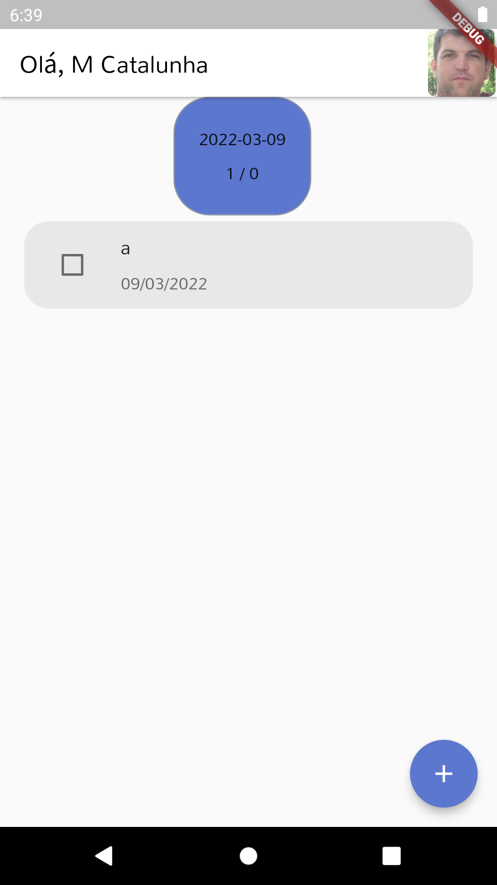
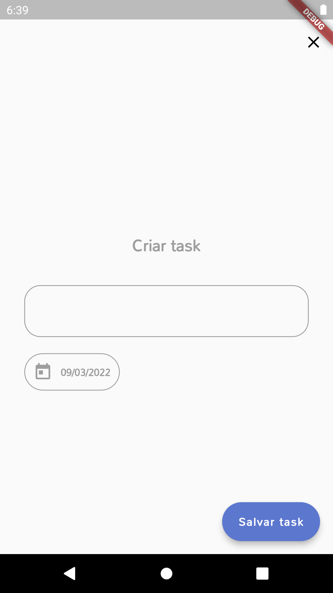

# Introdução

Este TodoGetxHive é um fork do TodoListProvider da Academia do Flutter, http://academiadoflutter.com.br/, vale a pena. Te convido pra fazer parte desta comunidade top.

Este projeto da AdF parece simples mas tras muito aprendizado interessante.

A versão do curso usa Provider e banco de dados sqflite. 

Contudo alterei para GetX e Hive.

Assim posso realizar alguns testes para web e outros que virão. Ele apaga as tasks assim que passa o dia.


|||
|---|---|


# HiveBase

Criei uma classe de uso do Hive: lib/app/core/database/hive/hivebase.dart

E estou querendo amplia-la, talvez para um package, para conter wheres e outros no padrao do firebase.
```
HiveBase.instance
  .box('users')
  .where('age', isGreaterThan: 20)
  .get()
  .then(...);
```

# Como executar localmente
Crie um projeto no firebase com Authenticação via email e google.

Crie uma aplicação Android. Registre o SHA1 para permitir login via google.

Copie o arquivo de config para:
/android/app/google-services.json

Creio que seja só isto :-)

# Ver boxes do hive
* Iniciar Android Studio
* Abrir projeto em desenvolvimento
* Clicar no icone Device File Explorer (geralmente fica na parte inferior canto direito )
* Abrir caminho
    * /data/data/[seu org].todo_list_provider/app_flutter/hiveBaseBoxes

# Issues

Agradeço a abertura de issues para correções e sugestões.

# Palavra final

Deus é bom e vale a pena andar em seus caminhos. Jesus Cristo é um necessaria referencia para nossas vidas.


